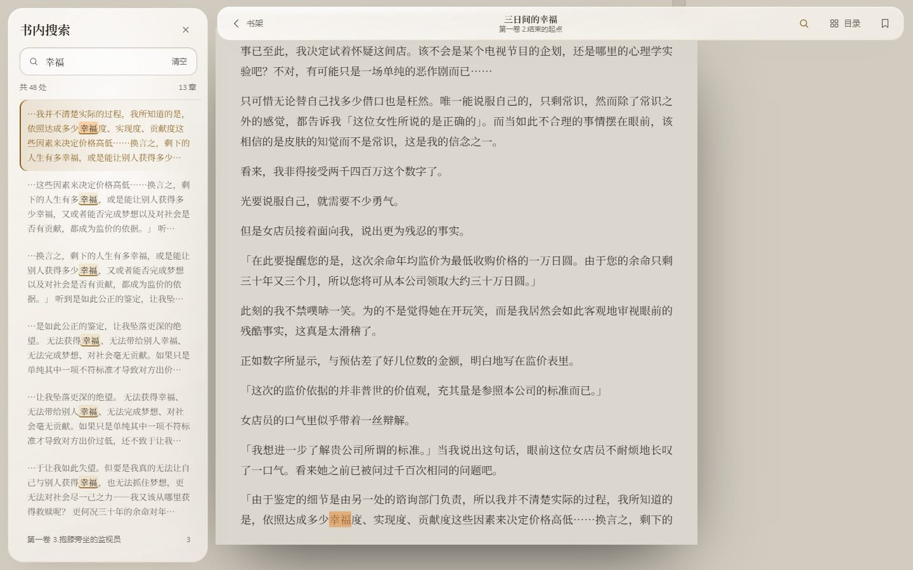

<div align="center">

# EBOOK

**好看的轻小说阅读器** · Windows / 安卓 / 网页

[下载最新版](https://github.com/shihshdh/ebook/releases/latest) · [运行与打包](docs/BUILD.md)

</div>


## 下载

| 平台 | 文件 |
|---|---|
| Windows 10 / 11 | [EBOOK_0.3.12_x64-setup.exe](https://github.com/shihshdh/ebook/releases/download/v0.3.12/EBOOK_0.3.12_x64-setup.exe) |
| 安卓 | [EBOOK_0.3.12.apk](https://github.com/shihshdh/ebook/releases/download/v0.3.12/EBOOK_0.3.12.apk) |

> Windows 第一次运行如果提示「Windows 已保护你的电脑」，点「更多信息 → 仍要运行」。

## 功能

- **书库**：轻小说文库约 4300 本（插图版按卷下载）、427 本中文公版古籍（简体 / 繁体）、本地 TXT / EPUB 导入
- **推荐**：近几年的口碑佳作，偏文笔细腻的作品；按奇幻、校园、科幻、恋爱、悬疑分区；首页新增 16 本「书源里的好书」，按书名和作者进入搜索
- **阅读器**：分页 / 滚动、四种纸张、划线笔记、书内全文搜索
- **书架**：继续阅读、阅读统计、筛选排序、笔记导出 Markdown
- **书源**：内置 209 个通过静态规则检查的文字书源，也支持导入 Legado（阅读 App）书源；网站实时可用性可在书源页「测一遍」
- **统一搜索**：文库与书源共用搜索池，同名且作者匹配的结果合并，在详情中保留各来源下载入口
- **书源审核与订阅**：书源只收文字书，订阅只收阅读内容；导入及读取旧数据时过滤成人、影音、漫画、软件工具等不符合规则的来源

## 截图

| 首页 · 细腻之选 | 探索 · 题材分区 |
|---|---|
|  |  |
| **详情 · 插图版按卷下载** | **阅读器 · 书内搜索** |
|  |  |


## 开发

```bash
npm install
npm run dev              # 网页预览 http://localhost:5180
npm run desktop:build    # Windows 安装包
```

安卓打包和签名见 [docs/BUILD.md](docs/BUILD.md)。

## 说明

EBOOK 本身不存放任何书籍内容：书目来自 [mojimoon/wenku8](https://github.com/mojimoon/wenku8) 和 Project Gutenberg 的公开数据，或你自己导入。请支持正版。
